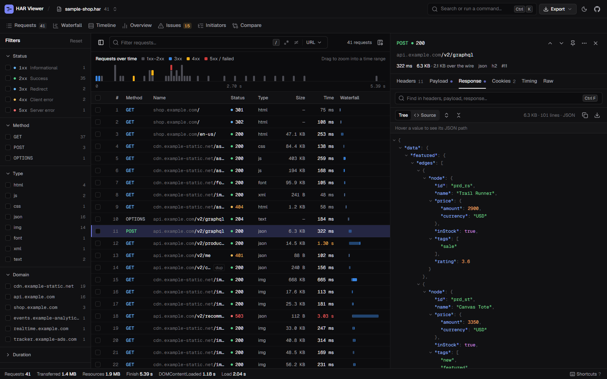

# HAR Viewer

Un visor de archivos HAR rápido y offline, creado para desarrolladores que pasan demasiado tiempo mirando las pestañas de red.

Suelte un archivo `.har` —incluso uno masivo— y obtenga una vista limpia, searchable y filtrable de cada solicitud. Sin subidas, sin servidores, todo permanece en su navegador.



## Por qué existe esto

Las DevTools del navegador son geniales hasta que necesitas compartir una captura de red, analizar cientos de solicitudes offline o comparar el tráfico de un dispositivo que no tienes delante. Los archivos HAR solucionan eso, pero la mayoría de los visores se bloquean con archivos grandes o te presentan una pared de JSON. Este no.

## Características

- **Manejo de archivos grandes** — Lectura de archivos fragmentada (chunked) y desplazamiento virtual (virtual scrolling). Diseñado para manejar miles de entradas.
- **Filtra todo** — Por método HTTP, código de estado, tipo de contenido, dominio o búsqueda de texto libre con soporte para regex.
- **Filtros de rango de tiempo/tamaño** — Muestra solo solicitudes más lentas que X ms o más grandes que Y KB.
- **Preajustes de filtro guardados** — Nombre y guarda tu combinación de filtros actual. Almacenados en localStorage para un uso rápido.
- **Inspección completa de solicitudes** — Cabeceras, payload, cuerpo de la respuesta, cookies (con auto-decodificación), desglose de tiempos con visualización de cascada (waterfall) y JSON HAR bruto.
- **Tema claro/oscuro** — Alterna entre modo oscuro y claro. Persistido entre sesiones.
- **Exportación a CSV** — Exporta entradas filtradas o seleccionadas como CSV para hojas de cálculo y compartir.
- **Exportación sanitizada** — Redacción en un clic de cabeceras de Autorización, cookies, tokens y claves de API antes de compartir un archivo HAR.
- **Agrupación de solicitudes** — Vista de tabla dinámica: agrupa por dominio, tipo de contenido o código de estado con estadísticas agregadas.
- **Información de rendimiento** — Ratio de aciertos de caché, uso de compresión, sobrecarga de preflight de CORS, desglose de versión de HTTP y análisis de tiempo promedio.
- **Validación de HAR** — Señala entradas mal formadas, tiempos faltantes, tamaños negativos y respuestas incompletas al cargar.
- **Comparación de archivos múltiples** — Carga dos archivos HAR lado a lado y compara las estadísticas generales para análisis de antes/después.
- **Vista de línea de tiempo** — Gráfico de llama (flame graph) horizontal de todas las solicitudes agrupadas por dominio, codificado por colores con tooltips.
- **Detección de solicitudes duplicadas** — Resalta solicitudes repetidas a la misma URL+método. Visible en el panel de problemas.
- **Anotaciones de solicitudes** — Agrega notas adhesivas a entradas individuales. Persistidas en localStorage.
- **Fusión de archivos HAR** — Combina múltiples archivos HAR en uno solo, ordenados por marca de tiempo.
- **Límites de error (Error boundaries)** — Si un solo componente falla, el resto de la aplicación sigue funcionando.
- **Opciones de exportación** — Fragmentos de HAR, CSV, HAR sanitizado, cURL, fetch, axios y cookies (Netscape/JSON).
- **Persistencia de sesión** — Refresca y retoma donde lo dejaste. Filtros, selección, posición del scroll, ancho del panel — todo persistido. Datos HAR almacenados en IndexedDB.
- **Amigable con el teclado** — Teclas de flecha para navegar, Escape para cerrar paneles, Ctrl+F para buscar.
- **Estado de filtro compartible** — Configuración de filtros codificada en el hash de la URL para compartir fácilmente.

## Primeros pasos

```bash
npm install
npm run dev
```

Luego ábrelo en tu navegador y suelta un archivo `.har` en la página.

## Build de producción

```bash
npm run build
npm run preview
```

## Cómo obtener un archivo HAR

- **Chrome/Edge**: DevTools → Pestaña Network → clic derecho → "Save all as HAR with content"
- **Firefox**: DevTools → Pestaña Network → icono de engranaje → "Save All As HAR"
- **HTTP Toolkit / Charles / Fiddler**: Exportar como HAR desde el menú de archivo

## Stack tecnológico

- React 19 + TypeScript
- Vite para builds
- Zustand para la gestión de estado (con persistencia en localStorage + IndexedDB)
- TanStack Virtual para el desplazamiento virtual
- Cero dependencias de CSS en tiempo de ejecución — CSS puro con propiedades personalizadas

## Estructura del proyecto

```
src/
  components/       # Componentes de UI
    tabs/           # Pestañas del panel de detalles (Headers, Payload, Response, Cookies, Timing, Raw)
  hooks/            # Hooks personalizados (carga de archivos, entradas filtradas)
  store/            # Store de Zustand con persistencia
  utils/            # Tipos, formateadores, parsers, exportadores, almacenamiento IndexedDB
```

## Licencia

MIT
