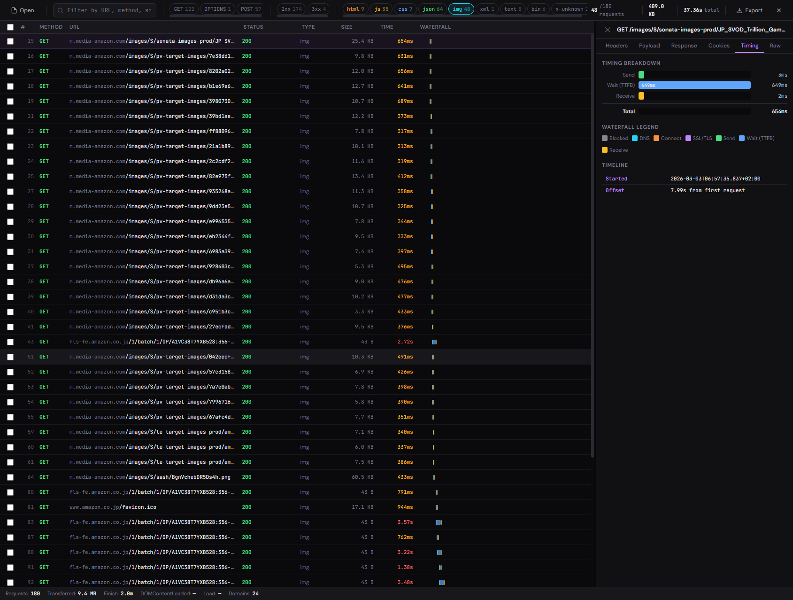

# HAR Viewer

A fast, offline HAR file viewer built for developers who spend too much time staring at network tabs.

Drop in a `.har` file — even a massive one — and get a clean, searchable, filterable view of every request. No uploads, no servers, everything stays in your browser.



## Why this exists

Browser DevTools are great until you need to share a network capture, dig through hundreds of requests offline, or compare traffic from a device you don't have in front of you. HAR files solve that, but most viewers either choke on large files or give you a wall of JSON. This one doesn't.

## Features

- **Handles large files** — Chunked file reading and virtual scrolling. Designed to handle thousands of entries.
- **Filter everything** — By HTTP method, status code, content type, domain, or free-text search with regex support.
- **Time/size range filters** — Show only requests slower than X ms or larger than Y KB.
- **Saved filter presets** — Name and save your current filter combo. Stored in localStorage for quick reuse.
- **Full request inspection** — Headers, payload, response body, cookies (with auto-decoding), timing breakdown with waterfall visualization, and raw HAR JSON.
- **Light/dark theme** — Toggle between dark and light mode. Persisted across sessions.
- **CSV export** — Export filtered or selected entries as CSV for spreadsheets and sharing.
- **Sanitized export** — One-click redaction of Authorization headers, cookies, tokens, and API keys before sharing a HAR file.
- **Request grouping** — Pivot table view: group by domain, content type, or status code with aggregate stats.
- **Performance insights** — Cache hit ratio, compression usage, CORS preflight overhead, HTTP version breakdown, and average timing analysis.
- **HAR validation** — Flags malformed entries, missing timings, negative sizes, and incomplete responses on load.
- **Multi-file comparison** — Load two HAR files side by side and diff overall stats for before/after analysis.
- **Timeline view** — Horizontal flame graph of all requests grouped by domain, color-coded with tooltips.
- **Duplicate request detection** — Highlights repeated requests to the same URL+method. Surfaced in the issues panel.
- **Request annotations** — Add sticky notes to individual entries. Persisted in localStorage.
- **HAR file merging** — Combine multiple HAR files into one, sorted by timestamp.
- **Error boundaries** — If a single component crashes, the rest of the app keeps working.
- **Export options** — HAR, CSV, sanitized HAR, cURL, fetch, axios snippets, cookies (Netscape/JSON).
- **Session persistence** — Refresh and pick up where you left off. Filters, selection, scroll position, panel width — all persisted. HAR data stored in IndexedDB.
- **Keyboard friendly** — Arrow keys to navigate, Escape to close panels, Ctrl+F to search.
- **Shareable filter state** — Filter configuration encoded in the URL hash for easy sharing.

## Getting started

```bash
npm install
npm run dev
```

Then open it in your browser and drop a `.har` file on the page.

## Production build

```bash
npm run build
npm run preview
```

## How to get a HAR file

- **Chrome/Edge**: DevTools → Network tab → right-click → "Save all as HAR with content"
- **Firefox**: DevTools → Network tab → gear icon → "Save All As HAR"
- **HTTP Toolkit / Charles / Fiddler**: Export as HAR from the file menu

## Tech stack

- React 19 + TypeScript
- Vite for builds
- Zustand for state management (with localStorage + IndexedDB persistence)
- TanStack Virtual for virtual scrolling
- Zero runtime CSS dependencies — plain CSS with custom properties

## Project structure

```
src/
  components/       # UI components
    tabs/           # Detail panel tabs (Headers, Payload, Response, Cookies, Timing, Raw)
  hooks/            # Custom hooks (file loading, filtered entries)
  store/            # Zustand store with persistence
  utils/            # Types, formatters, parsers, exporters, IndexedDB storage
```

## License

MIT
